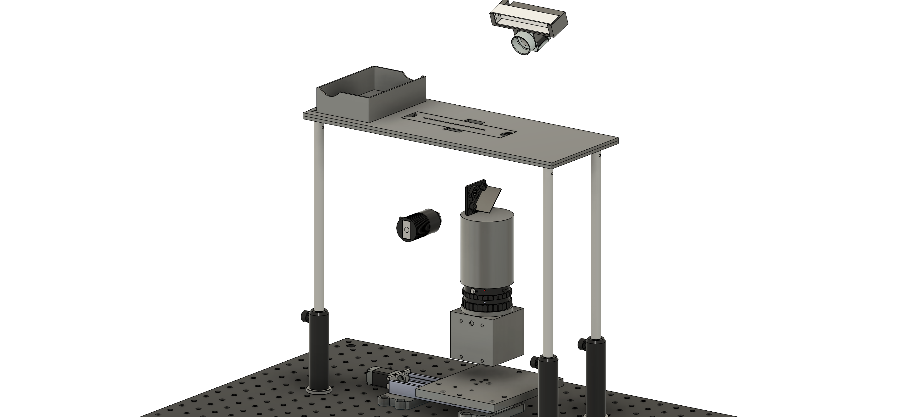

# Master_thesis
Automated setup and analysis of spontaneous muscle activity in Drosophila pupa

🌼 Repository with all the final informations, patterns and scripts used during my master project 🌼

- 🚀 Automated setup folder: overview video, custom pieces drawings, scripts
- 📈 Analysis folder: scripts and notebooks for preprocessing, extraction of data and analysis
- 🗎 Final Thesis report

Have fun discovering everything, don't hesitate to reach out for discussion or to report a problem/missing information. (leandre.dubey@gmail.com)
